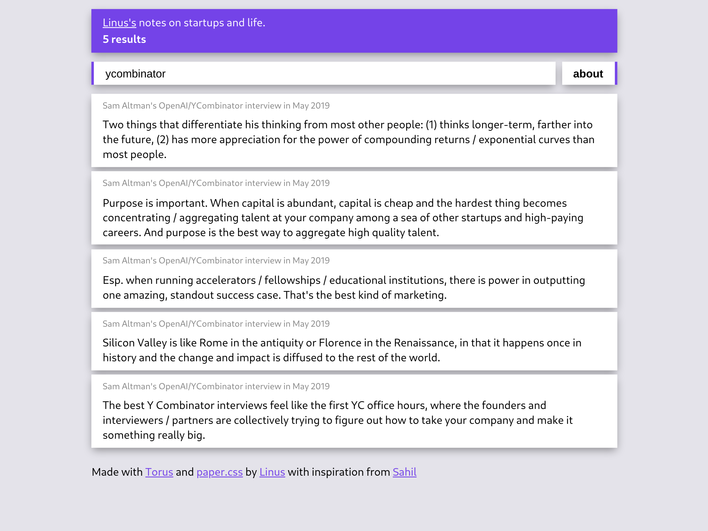

# entr

This is a simple web app wrapper around my text file of notes on readings, events, and videos from my last 5 or so years. You can search by keyword through the list of notes, matching on its source/group or its body. I'm planning on periodically updating its data source from my private notes going forward.

entr is built with [Torus](https://github.com/thesephist/torus) and styled with [paper.css](https://thesephist.github.io/paper.css/).

